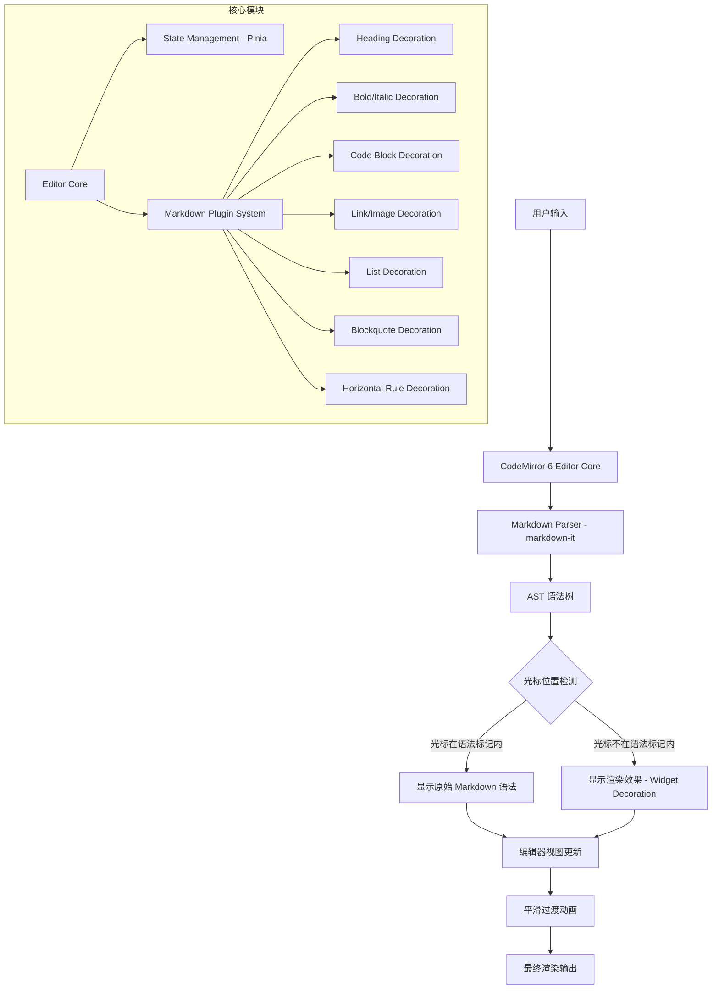

# Markdown 即时渲染编辑器 - 项目设计文档

## 1. 系统架构

## 2. 技术选型

| 层级 | 技术 | 说明 |
|------|------|------|
| 框架 | Vue 3 + Vite | SFC + Composition API |
| 编辑器引擎 | CodeMirror 6 | 高性能、可扩展的代码编辑器 |
| Markdown 解析 | markdown-it | 快速、可扩展的 Markdown 解析器 |
| 状态管理 | Pinia | 编辑器状态管理 |
| 样式 | SCSS | 自定义主题 |
| 构建 | Vite | 快速构建 |

## 3. 核心设计思路

### 即时渲染原理

1. **CodeMirror 6 Decoration 系统**：利用 CM6 的 `Decoration.replace` 和 `Decoration.widget` 在编辑器内直接替换/装饰文本
2. **光标感知**：通过 `ViewPlugin` 监听光标位置变化，判断光标是否在某个 Markdown 语法节点内
3. **平滑切换**：当光标进入/离开语法区域时，通过 CSS transition 实现渲染态和编辑态的平滑过渡
4. **无损编辑**：底层始终保持原始 Markdown 文本，渲染仅是视觉层的 Decoration

### 支持的 Markdown 语法

- **Heading** (h1-h6)：隐藏 `#` 标记，显示不同字号
- **Bold/Italic**：隐藏 `**` / `*` 标记，显示加粗/斜体
- **Strikethrough**：隐藏 `~~` 标记，显示删除线
- **Inline Code**：隐藏反引号，显示代码样式
- **Code Block**：隐藏围栏标记，显示代码块样式
- **Link**：隐藏语法，显示可点击链接
- **Image**：隐藏语法，显示图片预览
- **List**：美化列表标记
- **Blockquote**：美化引用样式
- **Horizontal Rule**：渲染分割线
- **Table**：渲染表格样式

### 标题目录（大纲）

- **提取**：`src/editor/outline.js` 从文档文本提取 ATX 标题（跳过围栏代码块），构建层级树；层级跳跃节点挂载到最近上级，保证树结构合法
- **当前项**：根据 store 中的光标行号计算「最后一个 line ≤ 光标行」的标题并高亮，内容/光标变化实时更新
- **定位**：点击目录项后通过 `EditorView.scrollIntoView` 将光标精确移动到标题行首并滚动至视口顶部
- **异常标注**：重复标题（文本相同）、层级跳跃（下跳超过 1 级）、超长标题（> 60 字符截断）均有独立标识；空文档/无标题/筛选无结果有空状态
- **持久化**：面板开关、折叠节点集合（按 `层级:文本` 生成稳定 key）、筛选关键词存于 localStorage，页面返回后自动恢复
- **布局**：目录为流内侧栏（flex 并列），推开而非遮挡编辑区

## 4. UI/UX 规范

| 属性 | 值 |
|------|-----|
| 主色调 | #1a73e8 |
| 背景色 | #ffffff (编辑区) / #f8f9fa (侧边栏) |
| 字体 | -apple-system, "Segoe UI", "Noto Sans SC", sans-serif |
| 代码字体 | "JetBrains Mono", "Fira Code", monospace |
| 正文字号 | 16px |
| 行高 | 1.75 |
| 圆角 | 8px |
| 阴影 | 0 2px 8px rgba(0,0,0,0.08) |
